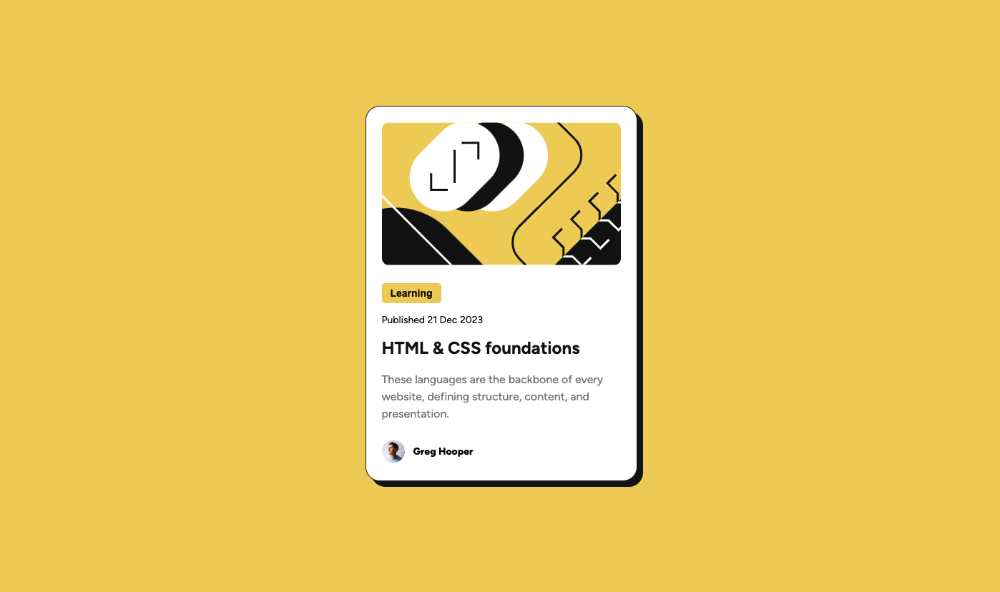

# Frontend Mentor - Blog preview card solution

This is a solution to the [Blog preview card challenge on Frontend Mentor](https://www.frontendmentor.io/challenges/blog-preview-card-ckPaj01IcS). Frontend Mentor challenges help you improve your coding skills by building realistic projects. 

## Table of contents

- [Overview](#overview)
  - [The challenge](#the-challenge)
  - [Screenshot](#screenshot)
  - [Links](#links)
- [My process](#my-process)
  - [Built with](#built-with)
  - [What I learned](#what-i-learned)
  - [Continued development](#continued-development)
- [Author](#author)

## Overview

### The challenge

Users should be able to:

- See hover and focus states for all interactive elements on the page

### Screenshot



### Links

- Solution URL: [Github](https://github.com/aaronli722/Blog-preview-card-challenge-on-Frontend-Mentor)
- Live Site URL: [https://aaronli722.github.io/Blog-preview-card-challenge-on-Frontend-Mentor/](https://aaronli722.github.io/Blog-preview-card-challenge-on-Frontend-Mentor/)

## My process

### Built with

- Semantic HTML5 markup
- CSS custom properties
- Flexbox

### What I learned

- The use of object-fit: cover which can cut the image without changing the dimension.

```css
.banner-img {
    width: 100%;
    height: 200px;
    object-fit: cover;
}
/* A height is set so the image will not be stretched */
```

- Vectically center the avatar and the name next to it using inline-flex

```css
.avatar {
    display: inline-flex;
    align-items: center;
}
```
 
- Vectically center the preview card when there is an attribution sentence at the bottom

```css
.container {
    display: flex;
    flex-direction: column;
    height: 100vh;
}
```

### Continued development

- When to use class and when to use id?
- Is it fine to take <main> as the card container class?

## Author

- Frontend Mentor - [@aaronli722](https://www.frontendmentor.io/profile/aaronli722)
- Twitter - [@luenlun](https://www.twitter.com/luenlun)
